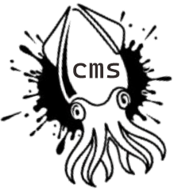
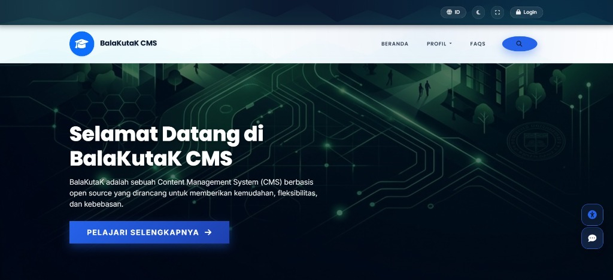
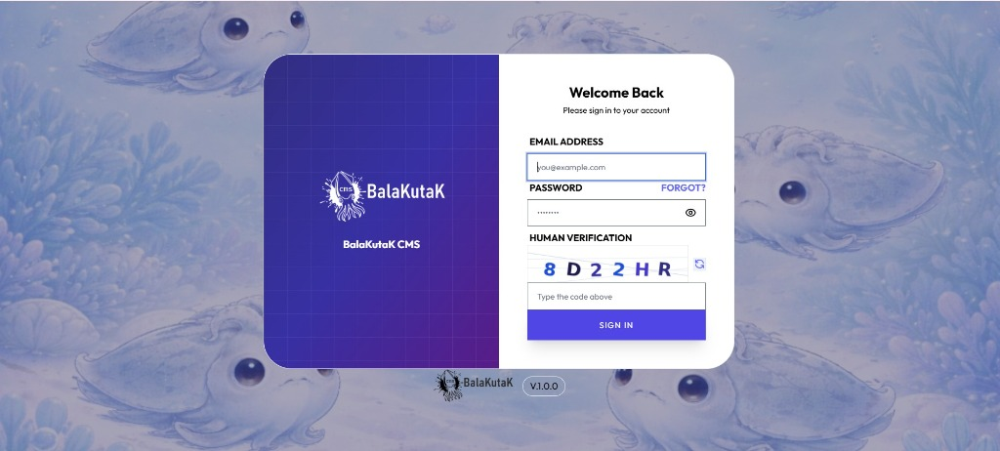
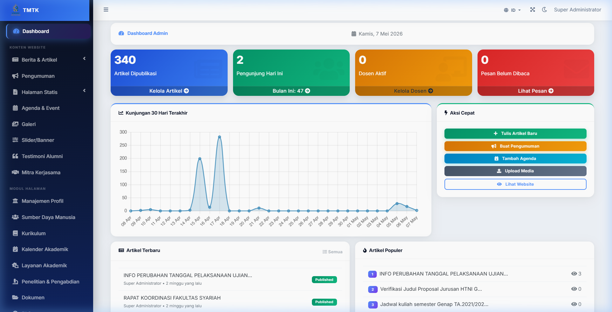
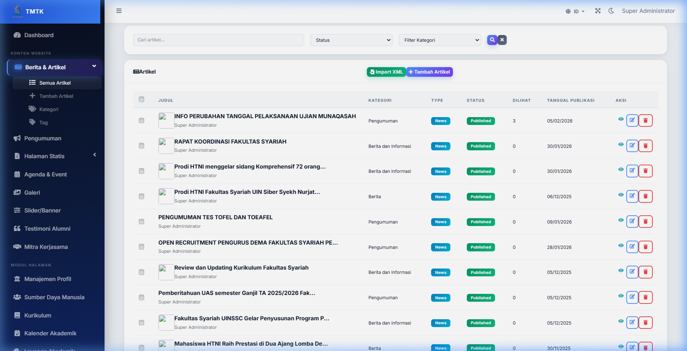
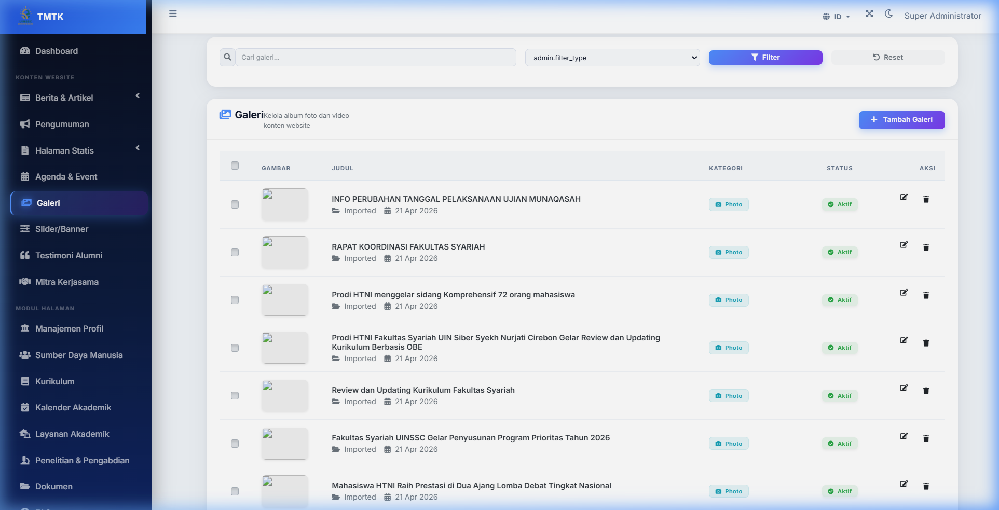
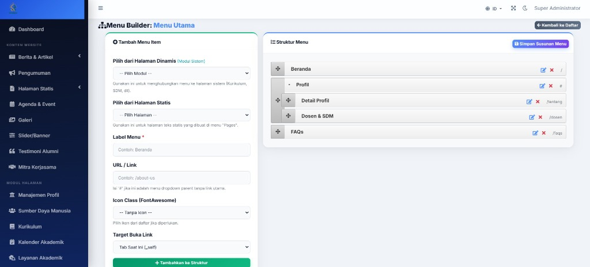
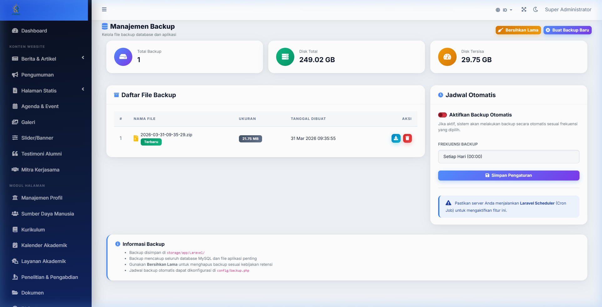
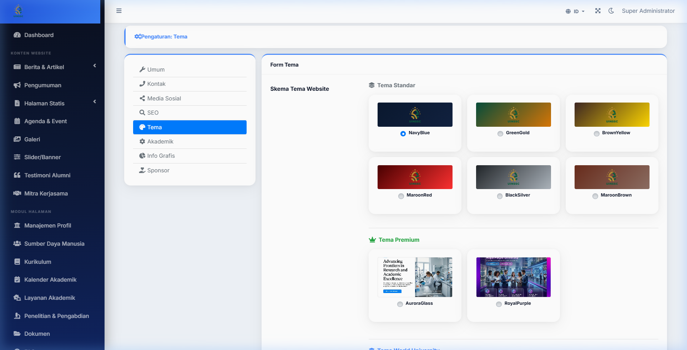

#  BalaKutaK CMS

[](https://opensource.org/licenses/MIT)
[](https://laravel.com)
[](#)

### Mengenal Lebih Dekat: BalaKutaK CMS
**BalaKutaK** adalah sistem manajemen konten (CMS) berbasis open-source yang dirancang khusus untuk menyederhanakan proses pembuatan dan pengelolaan situs web tanpa mengorbankan performa. Mengusung filosofi "Ringan & Adaptif", platform ini menjadi jembatan bagi siapa saja—mulai dari pemula hingga pengembang profesional—untuk menghadirkan identitas digital yang elegan.

### 🚀 Mengapa Memilih BalaKutaK?
Untuk memahami bagaimana BalaKutaK bekerja dalam ekosistem digital, berikut adalah pilar utama yang menyusun platform ini:
*   **Kebebasan Open-Source**: Dibangun di atas fondasi kolaborasi, memungkinkan pengguna untuk memodifikasi kode sumber sesuai kebutuhan spesifik tanpa batasan lisensi yang kaku.
*   **Performa Ringan (Ultra-Lightweight)**: Dirancang dengan struktur kode yang bersih, memastikan waktu pemuatan halaman (*loading speed*) yang cepat, bahkan pada server dengan spesifikasi standar.
*   **Antarmuka Adaptif**: Tampilan dashboard yang intuitif memastikan pengelolaan konten—seperti artikel, galeri, dan dokumen—dapat dilakukan dengan beberapa klik saja.
*   **Fleksibilitas Desain**: Mendukung integrasi tema yang modern dan responsif, sehingga website tampil sempurna di perangkat mobile maupun desktop.

### 🎯 Solusi Tepat untuk Berbagai Kebutuhan
BalaKutaK hadir untuk menjawab tantangan digital di berbagai sektor:
*   **🏫 Institusi Pendidikan**: Mempermudah pengelolaan profil sekolah, pengumuman akademik, hingga portal berita siswa dengan sistem yang aman.
*   **🤝 Organisasi & LSM**: Platform ideal untuk mempublikasikan laporan kegiatan, transparansi program, dan edukasi publik secara profesional.
*   **🌐 Komunitas Digital**: Ruang kolaborasi yang lincah untuk berbagi hobi, forum diskusi, atau sekadar blogging bersama dalam satu wadah.

### 🏗️ Arsitektur Sederhana, Hasil Maksimal
Secara teknis, BalaKutaK memisahkan antara manajemen data dan penyajian visual, sehingga pengguna bisa fokus pada konten sementara sistem menangani stabilitas dan keamanan di balik layar.

---

## ✨ Fitur Utama (Premium Features)

### 🎨 Immersive Experience & Design
*   **💎 Premium Immersive UI**: Antarmuka modern dengan efek gradasi sinematik, glassmorphism, dan animasi AOS (Animate On Scroll) yang halus.
*   **🎭 Dynamic Theme Engine**: Ganti suasana website secara instan dengan berbagai pilihan palet warna premium (NavyBlue, GreenGold, RoyalPurple, AuroraGlass, dll).
*   **🌓 Smart Dark Mode**: Dukungan mode gelap otomatis yang nyaman di mata untuk seluruh halaman frontend dan admin.
*   **🌐 Multilingual Support**: Fitur perpindahan bahasa (ID/EN) yang terintegrasi di seluruh bagian website.

### 📝 Content & Academic Management
*   **📰 Advanced News & Articles**: Pengelolaan konten berita dengan sistem kategori, tag, dan editor teks kaya (Rich Text Editor).
*   **🎓 Academic Suite**: Modul lengkap untuk institusi pendidikan meliputi:
    *   **Sumber Daya Manusia**: Profil dosen dan staf akademik yang komprehensif dengan dukungan ekspor data ke Excel (.xlsx).
    *   **Kurikulum**: Detail mata kuliah dan struktur program studi dengan dukungan ekspor data ke Excel (.xlsx).
    *   **Layanan & Penelitian**: Portal informasi layanan mahasiswa dan hasil pengabdian masyarakat dengan dukungan ekspor data ke Excel (.xlsx) serta fitur impor/impor-ulang dari Excel.
    *   **Sertifikat Akreditasi**: Integrasi pratinjau (viewer) sertifikat interaktif (untuk file Gambar & PDF) dengan fitur download langsung.
*   **📅 Event & Agenda**: Pengelolaan agenda kegiatan dengan hitung mundur (countdown), detail lokasi, serta integrasi tautan pendaftaran eksternal yang dinamis.
*   **📁 Centralized Document Manager**: Pusat unduhan dokumen resmi yang terorganisir.

### 🛠️ Customization & Site Builder
*   **🖱️ Drag & Drop Menu Builder**: Kelola navigasi website (header & footer) secara visual tanpa perlu menyentuh kode.
*   **🧱 Page Builder Integration**: Memungkinkan pembuatan halaman statis dengan tata letak kustom yang fleksibel.
*   **🖼️ Media Library & Gallery**: Manajemen aset gambar dan video yang terpusat dengan dukungan galeri album.
*   **📊 Infographic & Sponsor Module**: Kelola data statistik visual (infografis) dan logotipe mitra kerjasama dengan mudah.

### 🛡️ System & Security
*   **🔐 Secure Admin Dashboard**: Panel administrasi berbasis AdminLTE 3 yang responsif dengan sistem keamanan berlapis.
*   **👥 Role & Permission Management**: Kontrol akses pengguna (Super Admin & Admin) yang presisi menggunakan Laravel Permissions.
*   **💾 Integrated Backup System**: Fitur pencadangan otomatis untuk database dan file aplikasi dalam format terkompresi (.zip).
*   **🔍 SEO & Meta Management**: Pengaturan SEO dinamis untuk setiap halaman guna meningkatkan visibilitas di mesin pencari.
*   **🤖 Integrated Chatbot & Accessibility**: Fitur widget chatbot pintar dan aksesibilitas ramah disabilitas (Grayscale, Kontras Tinggi, Pembesar Font, Text-to-Speech, dll) dengan penataan posisi otomatis antibentrok dan pewarnaan dinamis adaptif sesuai varian warna tema (termasuk kustomisasi glassmorphic pada tema Aurora Glass).

---

## 📸 Pratinjau Aplikasi (Screenshots)

Berikut adalah beberapa tampilan dari BalaKutaK CMS:

### 🏠 Frontend (Halaman Utama)


### 🔐 Halaman Login


### 📊 Admin Dashboard


### 📝 Pengelolaan Konten (Posts)


### 🖼️ Galeri Media


### 🛠️ Menu Builder


### 💾 Sistem Backup


### 🎨 Pengaturan Tema


---

## 🚀 Panduan Instalasi (Quick Start)

Ikuti langkah-langkah berikut untuk menjalankan BalaKutaK CMS di lingkungan lokal Anda:

### 1. Persyaratan Sistem
*   PHP >= 8.2
*   Composer
*   Node.js & NPM
*   MySQL / MariaDB

### 2. Langkah Instalasi
```bash
# Clone repository
git clone https://github.com/riyantoabuwinner/balakutak.git
cd balakutak

# Install dependensi PHP
composer install

# Install dependensi Frontend
npm install
npm run build

# Salin konfigurasi environment
cp .env.example .env

# Generate application key
php artisan key:generate
```

### 3. Konfigurasi Database
Sesuaikan pengaturan database di file `.env`:
```env
DB_CONNECTION=mysql
DB_HOST=127.0.0.1
DB_PORT=3306
DB_DATABASE=nama_database_anda
DB_USERNAME=root
DB_PASSWORD=
```

### 4. Migrasi & Seeding (PENTING)
Jalankan perintah ini untuk membangun struktur tabel dan memasukkan data identitas BalaKutaK (termasuk logo & branding):
```bash
php artisan migrate:fresh --seed
php artisan storage:link
```

### 5. Jalankan Server
```bash
php artisan serve
```
Akses website di: `http://127.0.0.1:8000`
Akses Admin di: `http://127.0.0.1:8000/admin` (Login Default: `superadmin@prodi.ac.id` | `password`)

---

## 🛠️ Stack Teknologi

### 🛡️ Backend (Core Engine)
*   **Framework**: [Laravel 11](https://laravel.com) (PHP 8.2+)
*   **Database**: MySQL / MariaDB / SQLite
*   **Security**: [Spatie Permission](https://spatie.be/docs/laravel-permission) (Role & Permission), CSRF Protection, XSS Sanitization
*   **Automation**: [Spatie Laravel Backup](https://spatie.be/docs/laravel-backup), [Spatie Sitemap](https://spatie.be/docs/laravel-sitemap)
*   **Utilities**: Intervention Image (Image Processing), Laravel Excel (Export/Import), DomPDF (PDF Generation)

### 🎨 Frontend (User Interface)
*   **Styling**: [Tailwind CSS 3](https://tailwindcss.com) & Bootstrap 5
*   **Interactivity**: [Alpine.js](https://alpinejs.dev) & Axios
*   **Animations**: [AOS (Animate On Scroll)](https://michalsnik.github.io/aos/), Animate.css, Swiper.js (Sliders)
*   **Typography**: Google Fonts (Outfit, Inter, Poppins)

### 🔐 Admin Panel (Dashboard)
*   **Template**: [AdminLTE 3](https://adminlte.io)
*   **Data Handling**: DataTables (Server-side rendering)
*   **UI Components**: Select2, SweetAlert2, Toastr, Chart.js

### ⚙️ Development Tools
*   **Bundler**: Vite 5
*   **Dependency Manager**: Composer (PHP) & NPM (Node.js)
*   **Version Control**: Git

---

## 🦑 Filosofi Nama
**BalaKutaK** (Cumi-cumi/Sotong) dipilih sebagai simbol fleksibilitas, kecerdasan, dan kemampuan untuk beradaptasi dengan cepat di berbagai lingkungan (seperti cumi-cumi yang dapat berubah warna dan bentuk). BalaKutaK CMS diharapkan menjadi platform yang lincah namun kokoh dalam memenuhi kebutuhan digital penggunanya.

---

## 📄 Lisensi
**BalaKutaK CMS** adalah aplikasi *open-source* yang didedikasikan untuk seluruh pengguna yang membutuhkan solusi web yang handal dan elegan. Sebagai platform terbuka, aplikasi ini bebas untuk digunakan, dimodifikasi, dan dapat dikembangkan lebih lanjut oleh komunitas untuk memenuhi berbagai kebutuhan spesifik.

---

**Dikembangkan dengan ❤️ oleh [riyantoabuwinner](https://github.com/riyantoabuwinner)**
# balakutak
